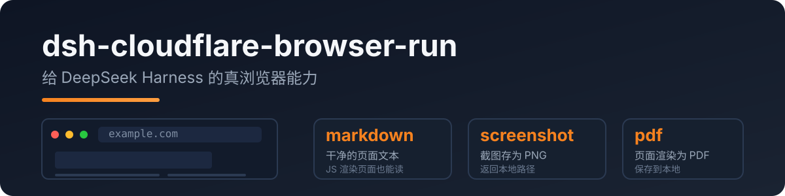

<p align="center">
  
</p>

# dsh-cloudflare-browser-run

给 DeepSeek Harness 的 agent **真正的浏览器访问能力**:headless Chrome 跑在 Cloudflare 网络上,JS 渲染页面、截图、PDF 都能处理。

> 由 [pi-cloudflare-browser-run](https://github.com/RealAlexandreAI/pi-cloudflare-browser-run) 移植,完全符合 dsh 的 Cordis 插件规范。

[English](README.md) · [中文](README.zh.md)

## 为什么需要它

dsh 内置的 `web_fetch` 只是普通 HTTP fetch——JS 页面拿回来是空壳,官方也标注 SSRF 防护待补。本插件补上:

- 任意公开页面的干净 **markdown**(SPA/JS 页面也能读)
- **截图**(PNG)和 **PDF**
- 登录态会话、WebMCP 站点

## 快速开始

```sh
dsh plugin --profile web add dsh-cloudflare-browser-run
```

在 profile/settings 层配置凭据:

```yaml
- id: cloudflare-browser-run
  name: dsh-cloudflare-browser-run
  config:
    cf_api_token: <你的 token>
    cf_account_id: <你的 account id>
```

Token:Cloudflare 控制台 → API Tokens → 模板选 **Browser Rendering: Edit**。
Account id:`dash.cloudflare.com/<ACCOUNT_ID>/...`。

## 工具

| 工具 | 说明 |
|---|---|
| `browse` | 抓取公开 URL → 干净 markdown(默认);`action` 可选 `screenshot` / `pdf` |
| `screenshot` | 页面截图存为 PNG,返回本地路径 |
| `pdf` | 页面渲染为 PDF,返回本地路径 |

## 配置

| 键 | 必填 | 说明 |
|---|---|---|
| `cf_api_token` | ✅ | 你的 API token(Browser Rendering:Edit) |
| `cf_account_id` | ✅ | 你的 Cloudflare 账号 ID |
| `cf_api_base` | – | API 地址覆盖 |
| `output_dir` | – | 截图/PDF 输出目录(默认系统临时目录) |

## 隐私

- **只访问公网**:所有 URL 先过 SSRF 防护(localhost/内网 IP/IPv6/userinfo 一律拒绝)
- token 只存在于你的配置文件——不写日志、不落盘
- Browser Run 以合规 bot 身份访问,是正规的抓取方式

## 开发

```bash
npm install
npm run typecheck
npm test          # SSRF 防护 / 配置 / API 调用形状
npm run build
```

真实 API 集成测试(不参与 `npm test`):

```bash
DSH_TEST_CF_TOKEN=<token> DSH_TEST_CF_ACCOUNT=<account> node --import tsx tests/real/real-cf.mjs
```

## License

MIT
